<!-- The pictures in guide/ are real app screens, rendered from the app's
     source by `node tool/screenshots/render.mjs`. Re-run it after UI changes
     and copy guide/ and this file to the public repository. -->

# Using MyMec

  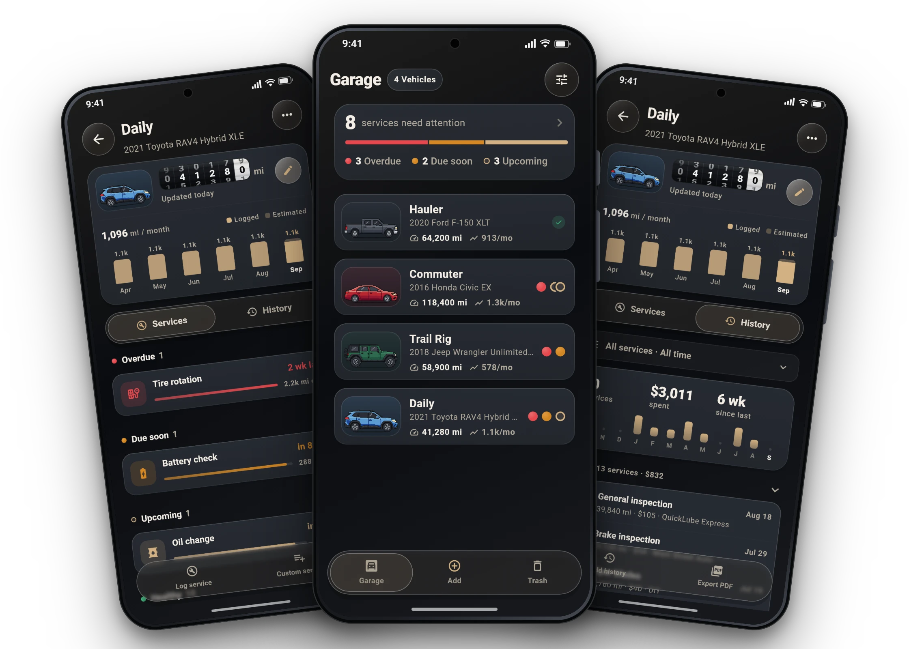

MyMec keeps each vehicle's service plan, odometer, and work history on your
phone and tells you what needs doing before it is due. This guide walks
through the app from the first launch to exporting a service record.

- [First launch](#first-launch)
- [Add a vehicle](#add-a-vehicle)
- [Your garage](#your-garage)
- [A vehicle's service plan](#a-vehicles-service-plan)
- [Logging and managing a service](#logging-and-managing-a-service)
- [History and PDF records](#history-and-pdf-records)
- [Reminders](#reminders)
- [Settings, cloud backup, and themes](#settings-cloud-backup-and-themes)
- [Trash](#trash)
- [Tips](#tips)

## First launch

  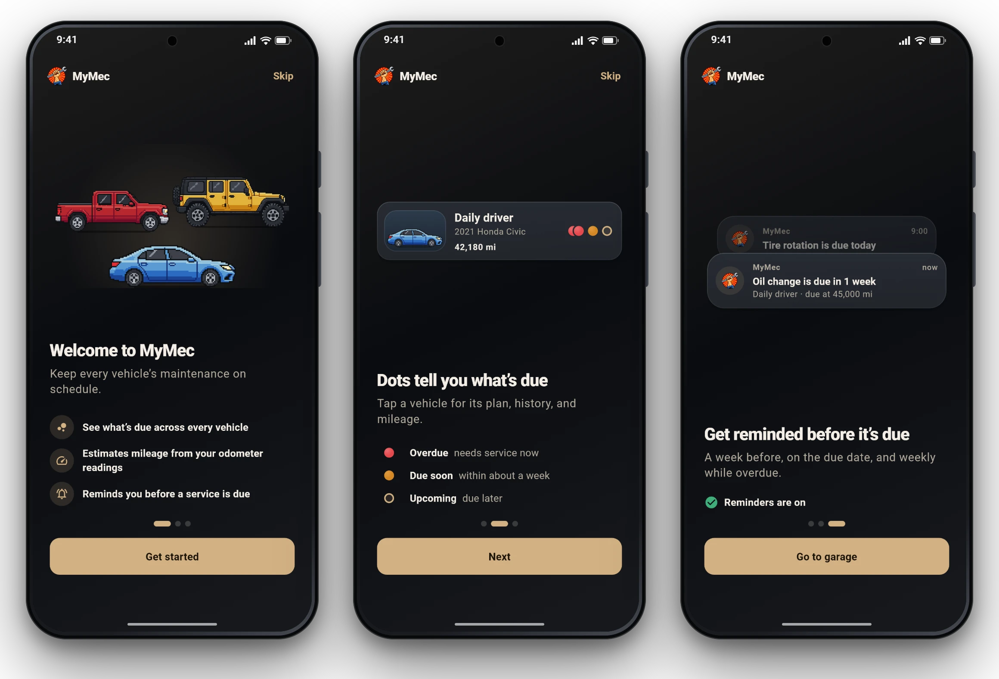

After you accept the Terms, three short pages introduce the app: what it
does, what the colored dots mean, and how reminders work. On the last page,
**Turn on reminders** asks for notification permission. You can skip the
tour and replay it any time from **Settings › Replay welcome tour**.

## Add a vehicle

  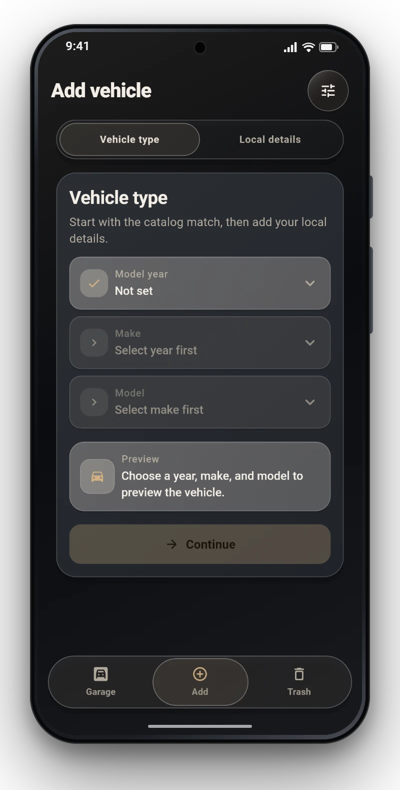

Open the **Add** tab. Under **Vehicle type**, pick the model year, then the
make and model from the built-in catalog (it works offline). Under **Local
details**, choose miles or kilometers and, if you like, add the trim, a
nickname, and the VIN. Then open the vehicle and enter its current odometer
reading with the pencil. **Edit vehicle** (the ••• menu) changes the details
later, including how the vehicle looks: its drawing and paint.

When you save, MyMec sets up a service plan of 16 common services with
intervals at the sooner end of typical guidance. Differential and transfer
case fluid start paused on vehicles that may not have them; turn them on if
yours does.

## Your garage

  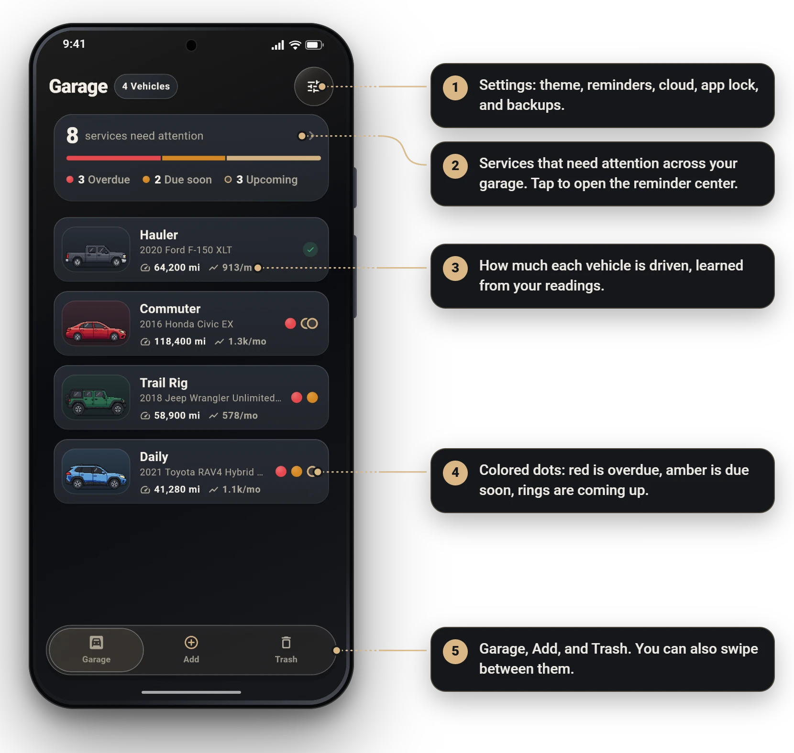

The garage lists every vehicle with its mileage and how much it is driven.
Instead of sentences, each card shows **severity dots**:

| Dot | Meaning |
|---|---|
| Red, filled | Overdue |
| Amber, filled | Due soon |
| Ring | Coming up |
| Green check | Nothing due |

The card at the top counts everything that needs attention across the
garage; tap it for the **reminder center**, which groups what is due by
vehicle. Tap a vehicle to open it.

## A vehicle's service plan

  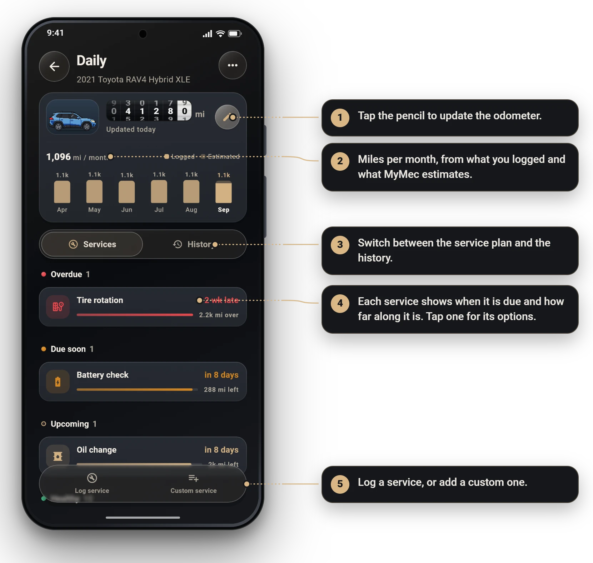

The top of the page shows the odometer and the miles driven each month.
**Update the odometer** every so often with the pencil: MyMec learns how much
you drive from your readings, so it can tell when a service comes due between
them.

Every service is due by **date or mileage, whichever comes first**. Each row
shows when it is due, a bar for how far along the interval you are, and the
miles left. Services are grouped by what needs doing first: overdue, due
soon, coming up, and healthy, followed by snoozed and paused ones.

The bar at the bottom logs a service or adds a **custom service** of your
own.

## Your vehicle's look

  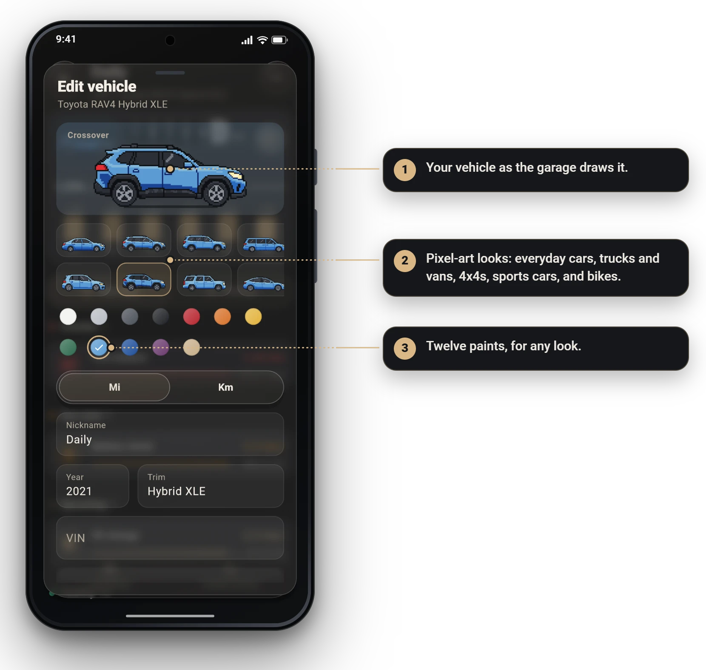

Every vehicle is drawn as a pixel-art side view. MyMec picks one from the
make and model when you add it, so many popular models get their own
drawing, and a few have a hidden one of their own. To change it, open the
vehicle's **•••** menu, choose **Edit vehicle**, and pick a look and a paint.

## Logging and managing a service

  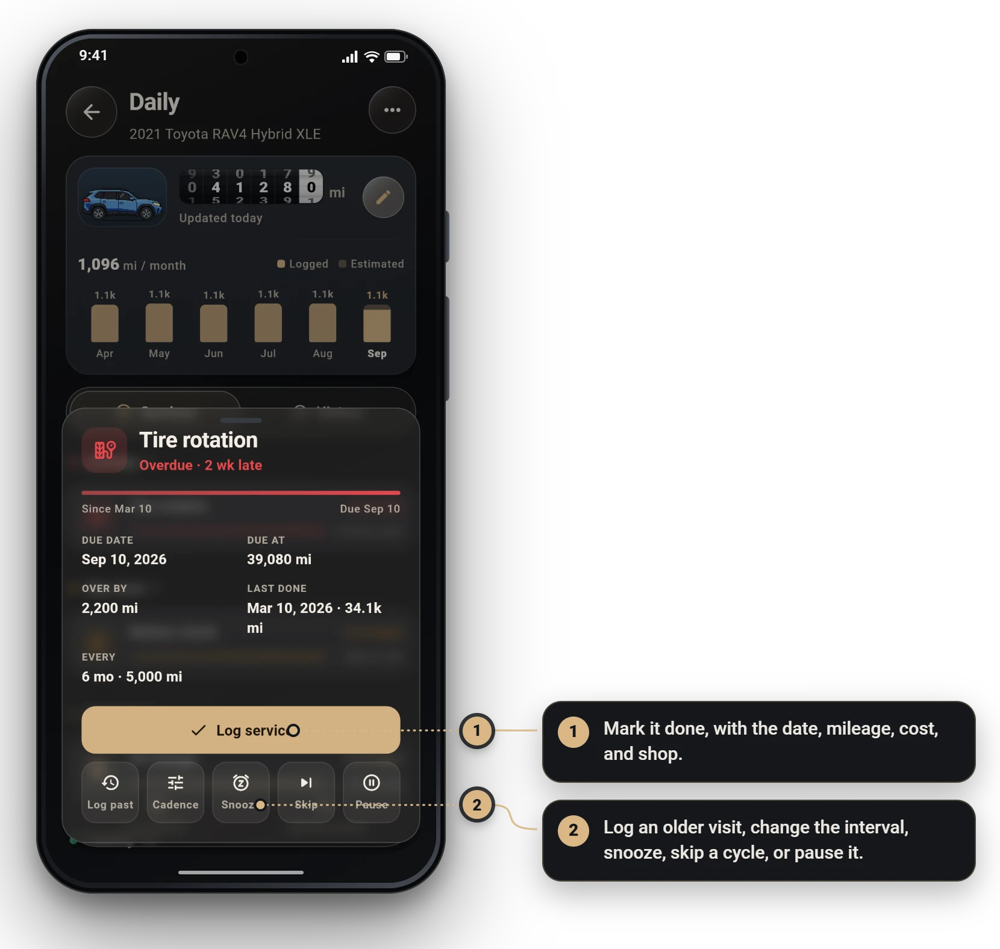

Tap any service to see when it is due, when it was last done, and its
interval. From here you can:

- **Log service** to mark it done, with the date, odometer, cost, and the
  shop (or DIY), plus parts, labor, and notes.
- **Log past** to add a visit you did before.
- **Cadence** to change the interval in months and miles, and how early to
  be reminded.
- **Snooze** to be reminded later, or **Skip** a cycle you don't need.
- **Pause** a service you don't want tracked, or delete it.

  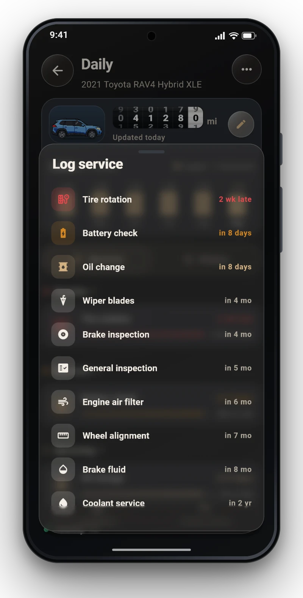

## History and PDF records

  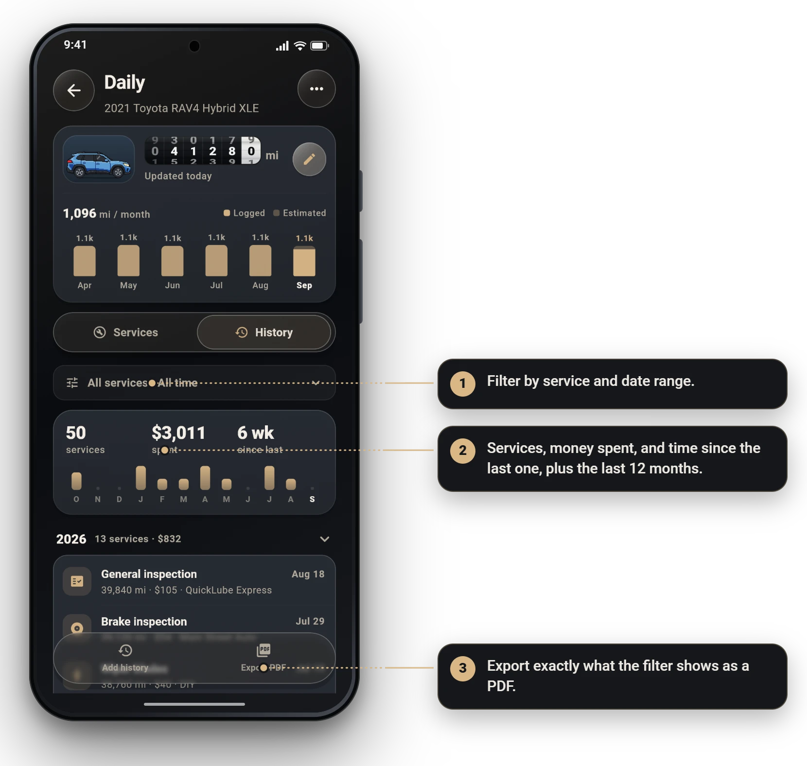

Switch to **History** to see every visit, grouped by year with its count and
cost. The summary shows how many services, how much you spent, and how long
since the last one, with a bar for each of the last 12 months. Filter by
service and date range; the summary follows the filter. Tap an entry to edit
it, or use **Add history** to enter older records.

  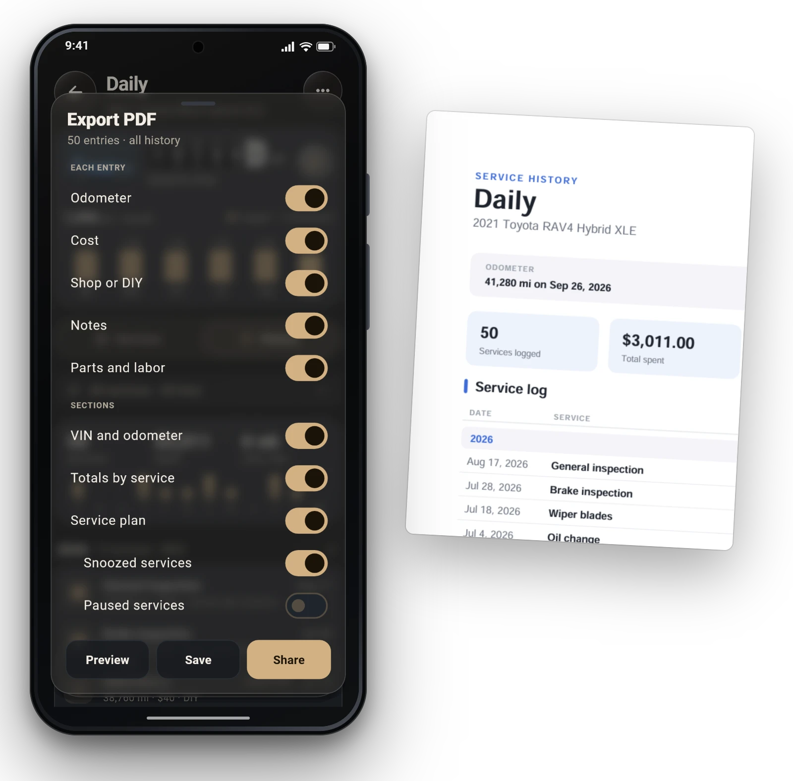

Tap **Export PDF** to export what the filter shows as a clean service record,
to print, email, or hand over when you sell. Choose what each entry includes
(odometer, cost, shop or DIY, notes, parts and labor) and which sections to
add (VIN and odometer, totals by service, and the current service plan).
**Preview** shows every page as it will print (pinch to zoom); then **Save**
it to your files or **Share** it.

## Reminders

  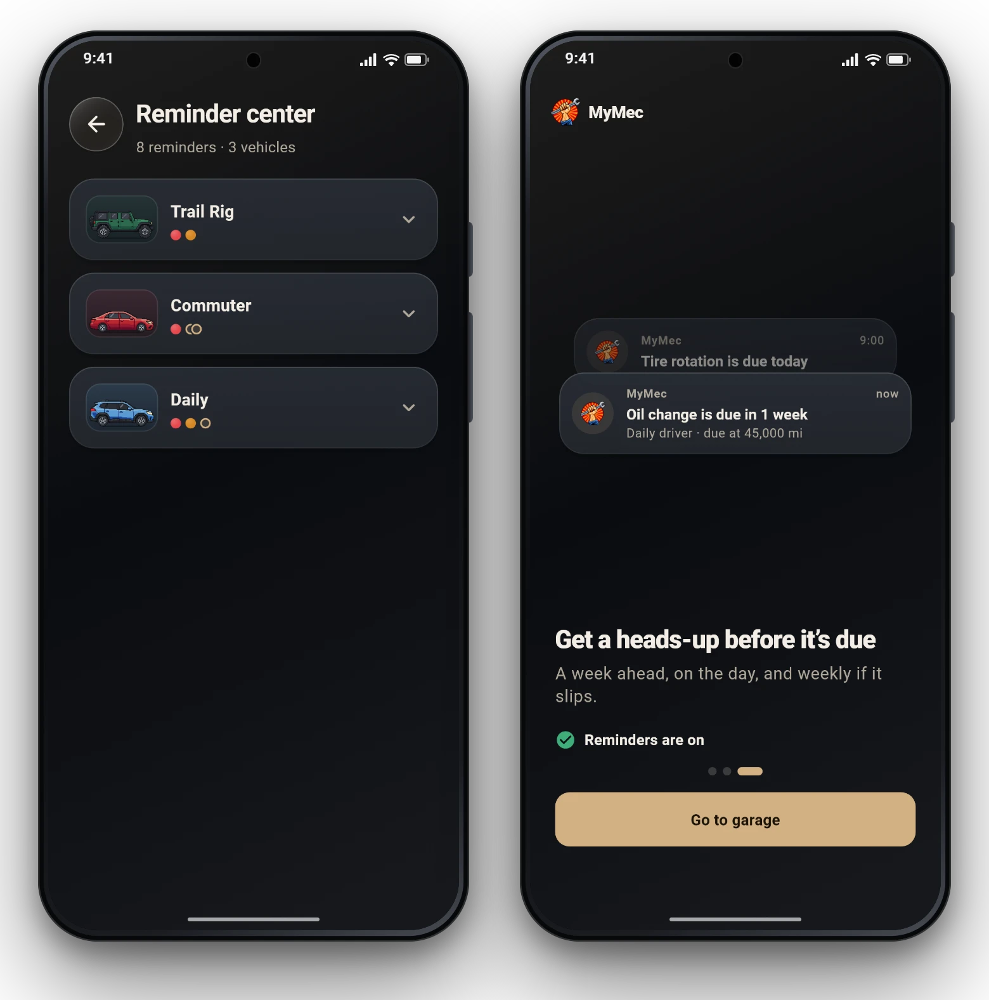

With notifications on, MyMec reminds you before a service is due, on the day
it is due, and weekly while it is overdue. Reminders are scheduled on your
phone; nothing is sent to a server. Tapping one opens the vehicle it is
about. Use **Settings › Send a test reminder** to check they come through.

## Settings, cloud backup, and themes

  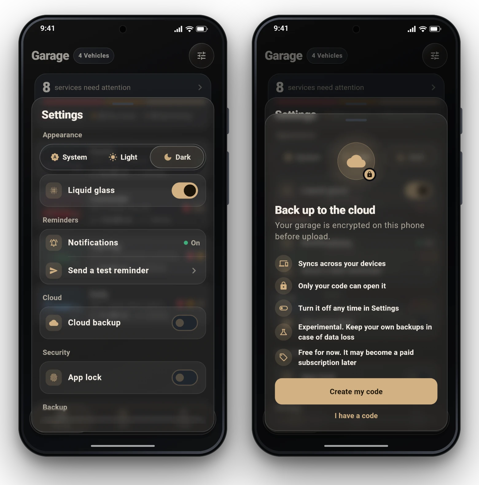

Open **Settings** from the garage (top right):

- **Appearance:** System, Light, or Dark; the **liquid glass** effect; and
  whether to skip the launch animation.
- **Reminders:** notification status, and a test reminder.
- **Cloud backup** (optional): keeps your garage in sync across your devices
  with a 16-digit account code. Your garage is encrypted on your phone before
  it is uploaded, so no one else can read it, and there is no email or
  password. Keep the code safe: it cannot be recovered.
- **App lock:** require Face ID, a fingerprint, or your passcode to open the
  app.
- **Backup:** export your whole garage to a `.mymec` file, or restore one.
  Before a restore replaces your data, MyMec keeps a safety copy.

  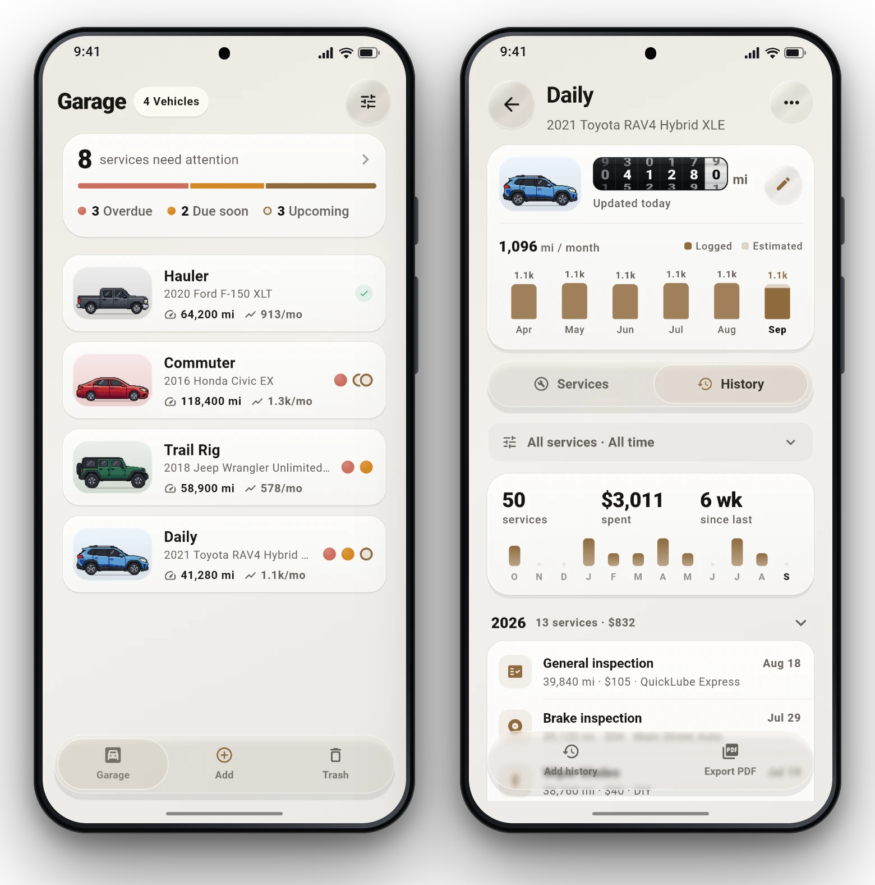

On Android, the app picks up your wallpaper's colors.

## Trash

  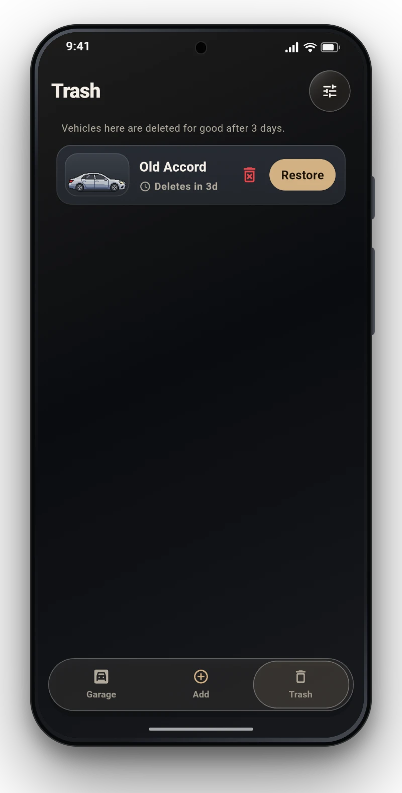

Removing a vehicle moves it to the **Trash** for 3 days, with its reminders
turned off. Restore it from there, or delete it for good right away.

## Tips

- Update the odometer when you fill up or every couple of weeks. The more
  readings MyMec has, the better it predicts mileage-based services.
- Add your past service records once: the history, spend totals, and due
  dates all get more accurate.
- Export a `.mymec` backup before you switch phones, or turn on cloud backup.
- Questions or ideas? Open an issue in this repository or email
  help@bosstudio.org.
